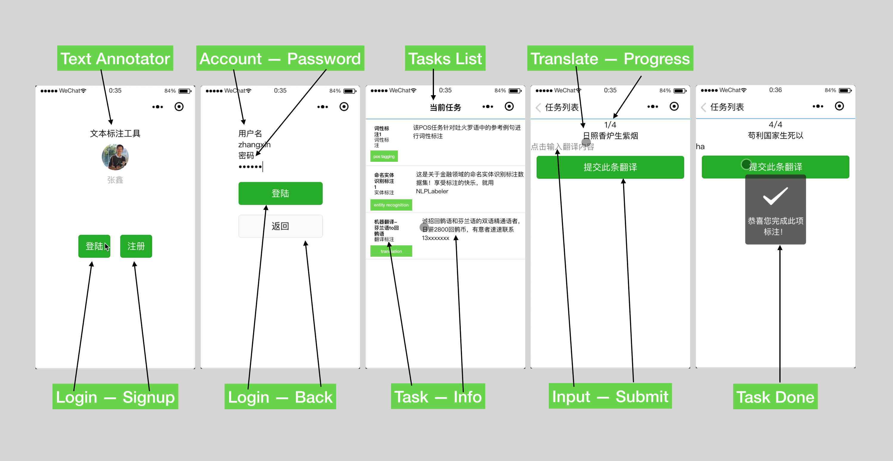

[点击这里](./README.md) 查看中文版的Readme
----

本项目以微信小程序为载体，实现nlp标注任务的分发与收集，可以实现远程办公，随时标注的功能。  
点击[使用视频](./images/demo.mov)查看demo。

## 前端

前端的文件夹结构是微信小程序文件存储的默认结构。主要的内容是位于TextAnnotator/pages中的五个页面：

* 初始的index，可以选择登录或者注册的页面
* 登录的login：登录已有账号的页面
* 注册的signup：注册新账号的页面
* 任务列表tasks：当前用户的所有任务的页面
* 标注界面annotate：具体小任务的标注页面

各自的页面结构在答辩PPT的demo视频中可看到。

前端使用JavaScript脚本实现数据收集和与后台的交互，使用基于html和css改造的wxml和wxss实现内容的可视化。

## 后端

后端的部分在[另一个网页上](https://github.com/dxwyc/Anteater)。其主要内容有：

* 用户登录系统 login.py

* 会话管理系统 session.py

* 用户注册系统 register.py

* 后台管理系统 back.py

* 数据库操控 db.py

**数据库介绍：nlplabeler**

实现整个nlp标注功能所依赖的后台数据库，拥有用户信息、标注任务信息以及标注数据集的综合信息，可实现为不同用户设计不同权限的功能，分为user，admin，super三个类型，表示普通标注员、高级标注员、系统设计员。高级标注员可以标注高级任务和高权限任务。super用户可以设计并管理所有的标注任务集合以及添加标注数据。其所含表如下：

| 数据表   | 内容                                                         |
| -------- | ------------------------------------------------------------ |
| datasets | 存放有所有标注任务的数据集，数据项编号entry_id，是否标注is_annotated，数据source，标注labels，标注质量quality，最后一次标注时间last_annotated_time |
| tasks    | 存放所有的项目信息，包含项目编号tid，项目名称taskname，项目类型type，项目表名tablename，项目介绍introduction，项目是否公开ispublic |
| users    | 存放所有的用户信息，包含uid, username, pwd, grp, is_expert，分别表示用户id，用户名，密码，用户组，和是否是专家。grp对应着不同的用户权限分组，is_expert会在之后标注准确性的验证上发挥作用。 |

### 使用与配置环境

前端：直接使用微信开发者工具打开此文件夹，即可看到文件结构和对应功能。

后端：在mysql数据库中执行nlplabeler.sql，修改对应mysql服务器登陆账号密码即可。

